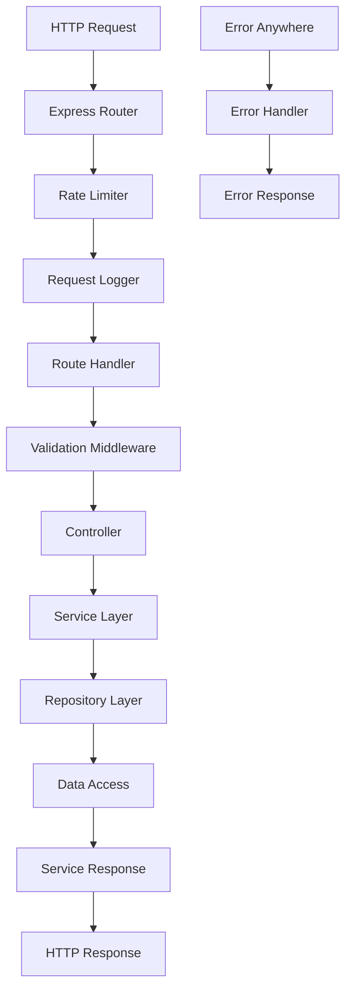

# 📋 TÀI LIỆU PHÂN TÍCH KỸ THUẬT
## Express TypeScript Boilerplate 2025

### 🎯 TỔNG QUAN DỰ ÁN

**Tên dự án:** Express TypeScript Boilerplate 2025  
**Mục đích:** Template khởi tạo nhanh cho các ứng dụng backend sử dụng Express.js và TypeScript  
**Phiên bản:** 1.0.14  
**Tác giả:** Edwin Hernandez  
**Giấy phép:** MIT License  

### 🏗️ KIẾN TRÚC TỔNG THỂ

#### Mô hình kiến trúc: Layered Architecture (Kiến trúc phân lớp)

```
┌─────────────────────────────────────────────────────────────────┐
│                        PRESENTATION LAYER                       │
│                    (Controllers & Routers)                      │
├─────────────────────────────────────────────────────────────────┤
│                        BUSINESS LAYER                           │
│                         (Services)                              │
├─────────────────────────────────────────────────────────────────┤
│                       DATA ACCESS LAYER                         │
│                       (Repositories)                            │
├─────────────────────────────────────────────────────────────────┤
│                        DATA LAYER                               │
│                    (Models & Database)                          │
└─────────────────────────────────────────────────────────────────┘
```

#### Đặc điểm kiến trúc:
- **Clean Architecture:** Tách biệt rõ ràng các layer
- **Dependency Injection:** Sử dụng constructor injection
- **Repository Pattern:** Abstraction cho data access
- **Service Pattern:** Tập trung business logic
- **MVC Pattern:** Model-View-Controller cho web API

### 📁 CẤU TRÚC THƯ MỤC CHI TIẾT

```
src/
├── api/                          # Các API modules
│   ├── healthCheck/              # Health check endpoint
│   │   ├── __tests__/            # Unit tests
│   │   └── healthCheckRouter.ts  # Router định nghĩa endpoint
│   └── user/                     # User module (ví dụ)
│       ├── __tests__/            # Unit tests
│       ├── userController.ts     # HTTP request handlers
│       ├── userModel.ts          # Data models và validation schemas
│       ├── userRepository.ts     # Data access layer
│       ├── userRouter.ts         # Route definitions
│       └── userService.ts        # Business logic
├── api-docs/                     # OpenAPI/Swagger documentation
│   ├── __tests__/                # Documentation tests
│   ├── openAPIDocumentGenerator.ts  # Tạo OpenAPI spec
│   ├── openAPIResponseBuilders.ts   # Helper tạo API responses
│   └── openAPIRouter.ts          # Swagger UI router
├── common/                       # Shared utilities và middleware
│   ├── __tests__/                # Common tests
│   ├── middleware/               # Express middleware
│   │   ├── errorHandler.ts       # Global error handling
│   │   ├── rateLimiter.ts        # Rate limiting
│   │   └── requestLogger.ts      # HTTP request logging
│   ├── models/                   # Shared models
│   │   └── serviceResponse.ts    # Standardized API response
│   └── utils/                    # Utility functions
│       ├── commonValidation.ts   # Common validation rules
│       ├── envConfig.ts          # Environment configuration
│       └── httpHandlers.ts       # HTTP utilities
├── index.ts                      # Application entry point
└── server.ts                     # Express server setup
```

### 🔧 CÔNG NGHỆ VÀ DEPENDENCIES

#### Core Dependencies (Phụ thuộc chính)
- **Express 5.1.0:** Web framework chính
- **TypeScript 5.8.3:** Type-safe JavaScript
- **Zod 3.25.67:** Schema validation và type inference
- **Pino 9.7.0:** High-performance logging
- **Helmet 8.1.0:** Security headers
- **CORS 2.8.5:** Cross-origin resource sharing

#### Development Dependencies (Phụ thuộc phát triển)
- **Vitest 3.2.3:** Testing framework
- **Biome 1.9.4:** Code formatting và linting
- **TSX 4.20.3:** TypeScript execution
- **TSUP 8.5.0:** TypeScript bundler
- **Supertest 7.1.1:** HTTP testing

#### API Documentation
- **@asteasolutions/zod-to-openapi 7.3.4:** Tự động tạo OpenAPI từ Zod schemas
- **swagger-ui-express 5.0.1:** Swagger UI interface

### 🎛️ CẤU HÌNH MÔI TRƯỜNG

#### Environment Variables (Biến môi trường)
```typescript
interface EnvironmentConfig {
  NODE_ENV: 'development' | 'production' | 'test'  // Môi trường chạy
  HOST: string                                      // Host server (default: localhost)
  PORT: number                                      // Port server (default: 8080)
  CORS_ORIGIN: string                              // CORS origin (default: http://localhost:8080)
  COMMON_RATE_LIMIT_MAX_REQUESTS: number           // Giới hạn requests (default: 1000)
  COMMON_RATE_LIMIT_WINDOW_MS: number              // Thời gian window rate limit (default: 1000ms)
}
```

#### Validation Logic:
- Sử dụng **Zod** cho type-safe environment validation
- Fail-fast nếu environment variables không hợp lệ
- Cung cấp default values hợp lý

### 🔀 LUỒNG XỬ LÝ REQUEST



#### Chi tiết từng bước:

1. **HTTP Request:** Client gửi request tới server
2. **Express Router:** Express định tuyến request tới đúng handler
3. **Rate Limiter:** Kiểm tra giới hạn số requests
4. **Request Logger:** Ghi log thông tin request
5. **Route Handler:** Xử lý route cụ thể
6. **Validation Middleware:** Validate request data với Zod schemas
7. **Controller:** Nhận request, gọi service, trả response
8. **Service Layer:** Xử lý business logic
9. **Repository Layer:** Truy cập và thao tác dữ liệu
10. **Service Response:** Trả về kết quả theo format chuẩn

### 📊 PHÂN TÍCH CÁC LAYER

#### 1. Presentation Layer (Controller & Router)

**Trách nhiệm:**
- Nhận và xử lý HTTP requests
- Validate input data
- Gọi business logic
- Format và trả về responses

**Ví dụ - UserController:**
```typescript
class UserController {
  public getUsers: RequestHandler = async (_req: Request, res: Response) => {
    const serviceResponse = await userService.findAll();
    res.status(serviceResponse.statusCode).send(serviceResponse);
  };

  public getUser: RequestHandler = async (req: Request, res: Response) => {
    const id = Number.parseInt(req.params.id as string, 10);
    const serviceResponse = await userService.findById(id);
    res.status(serviceResponse.statusCode).send(serviceResponse);
  };
}
```

#### 2. Business Layer (Service)

**Trách nhiệm:**
- Chứa business logic chính
- Xử lý các rule nghiệp vụ
- Orchestrate các operations
- Handle exceptions và logging

**Ví dụ - UserService:**
```typescript
export class UserService {
  private userRepository: UserRepository;

  constructor(repository: UserRepository = new UserRepository()) {
    this.userRepository = repository;
  }

  async findAll(): Promise<ServiceResponse<User[] | null>> {
    try {
      const users = await this.userRepository.findAllAsync();
      if (!users || users.length === 0) {
        return ServiceResponse.failure("No Users found", null, StatusCodes.NOT_FOUND);
      }
      return ServiceResponse.success<User[]>("Users found", users);
    } catch (ex) {
      const errorMessage = `Error finding all users: $${(ex as Error).message}`;
      logger.error(errorMessage);
      return ServiceResponse.failure(
        "An error occurred while retrieving users.",
        null,
        StatusCodes.INTERNAL_SERVER_ERROR,
      );
    }
  }
}
```

#### 3. Data Access Layer (Repository)

**Trách nhiệm:**
- Abstract data access logic
- Cung cấp interface cho data operations
- Handle database connections
- Implement CRUD operations

**Ví dụ - UserRepository:**
```typescript
export class UserRepository {
  async findAllAsync(): Promise<User[]> {
    return users; // Hiện tại dùng in-memory data
  }

  async findByIdAsync(id: number): Promise<User | null> {
    return users.find((user) => user.id === id) || null;
  }
}
```

### 🛡️ BẢO MẬT VÀ MIDDLEWARE

#### Security Middleware Stack:
1. **Helmet:** Thêm security headers
2. **CORS:** Kiểm soát cross-origin requests
3. **Rate Limiter:** Ngăn chặn abuse và DDoS
4. **Input Validation:** Validate mọi input với Zod

#### Error Handling Strategy:
- **Global Error Handler:** Catch mọi unhandled errors
- **Graceful Degradation:** Fail safely với meaningful messages
- **Security-first:** Không expose sensitive information
- **Logging:** Detailed logs cho debugging

### 📈 MONITORING VÀ LOGGING

#### Health Check Endpoint:
```typescript
// GET /health-check
{
  "success": true,
  "message": "Service is healthy",
  "responseObject": null,
  "statusCode": 200
}
```

#### Logging Strategy:
- **Pino:** High-performance structured logging
- **Request Logging:** Mọi HTTP requests được log
- **Error Logging:** Chi tiết errors với stack traces
- **Performance Logging:** Response times và resource usage

### 🔄 API RESPONSE FORMAT

#### Standardized ServiceResponse:
```typescript
interface ServiceResponse<T> {
  success: boolean;        // Trạng thái thành công/thất bại
  message: string;         // Thông báo readable cho client
  responseObject: T;       // Dữ liệu trả về (có thể null)
  statusCode: number;      // HTTP status code
}
```

#### Ví dụ Responses:

**Success Response:**
```json
{
  "success": true,
  "message": "Users found",
  "responseObject": [
    {
      "id": 1,
      "name": "Alice",
      "email": "alice@example.com",
      "age": 42,
      "createdAt": "2024-01-01T00:00:00.000Z",
      "updatedAt": "2024-01-06T00:00:00.000Z"
    }
  ],
  "statusCode": 200
}
```

**Error Response:**
```json
{
  "success": false,
  "message": "User not found",
  "responseObject": null,
  "statusCode": 404
}
```

### 🧪 TESTING STRATEGY

#### Testing Framework:
- **Vitest:** Fast unit testing
- **Supertest:** HTTP endpoint testing
- **Coverage:** Built-in code coverage reporting

#### Test Organization:
- Unit tests trong `__tests__` folders
- Integration tests cho API endpoints
- Mocking dependencies với Vitest
- Coverage reports với thresholds

#### Test Commands:
```bash
pnpm test          # Chạy tất cả tests
pnpm test:cov      # Chạy tests với coverage report
```

### 📚 API DOCUMENTATION

#### OpenAPI/Swagger Integration:
- **Automatic Generation:** Từ Zod schemas tự động tạo OpenAPI spec
- **Interactive UI:** Swagger UI tại `/swagger`
- **Type Safety:** Schema validation và TypeScript types cùng source
- **Real-time Updates:** Documentation luôn sync với code

#### Accessing Documentation:
- **Swagger UI:** `http://localhost:8080/swagger`
- **JSON Spec:** `http://localhost:8080/swagger.json`

### 🐳 CONTAINERIZATION

#### Docker Strategy:
- **Multi-stage Build:** Optimize image size
- **Production Ready:** Minimal Alpine Linux base
- **Security:** Non-root user execution
- **Caching:** Efficient layer caching cho faster builds

#### Docker Commands:
```bash
docker build -t express-app .
docker run -p 8080:8080 express-app
```

### ⚡ PERFORMANCE CONSIDERATIONS

#### Optimizations Implemented:
- **Structured Logging:** Pino cho high-performance logging
- **Efficient Bundling:** TSUP cho optimized builds
- **Rate Limiting:** Ngăn resource abuse
- **Graceful Shutdown:** Proper cleanup khi shutdown

#### Scalability Features:
- **Stateless Design:** Dễ dàng horizontal scaling
- **Environment-based Config:** Flexible deployment
- **Health Checks:** Load balancer integration
- **Container Ready:** K8s/Docker deployment

### 🔮 FUTURE EXTENSIBILITY

#### Easy Extension Points:
1. **New API Modules:** Copy user module pattern
2. **Database Integration:** Replace repository implementations
3. **Authentication:** Add auth middleware
4. **Monitoring:** Integrate APM solutions
5. **Caching:** Add Redis/Memory caching layers

#### Design Patterns Used:
- **Repository Pattern:** Easy database switching
- **Dependency Injection:** Testable và flexible
- **Factory Pattern:** Service instantiation
- **Observer Pattern:** Middleware chain
- **Strategy Pattern:** Different validation strategies 